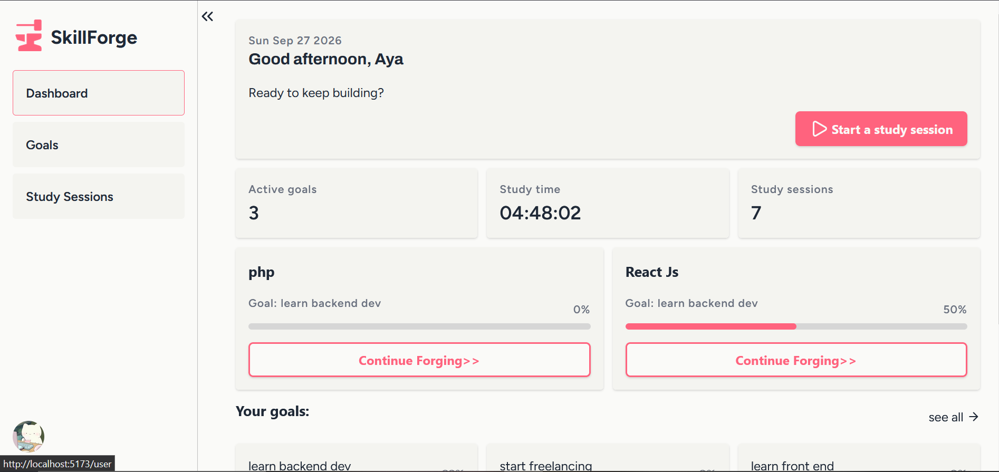
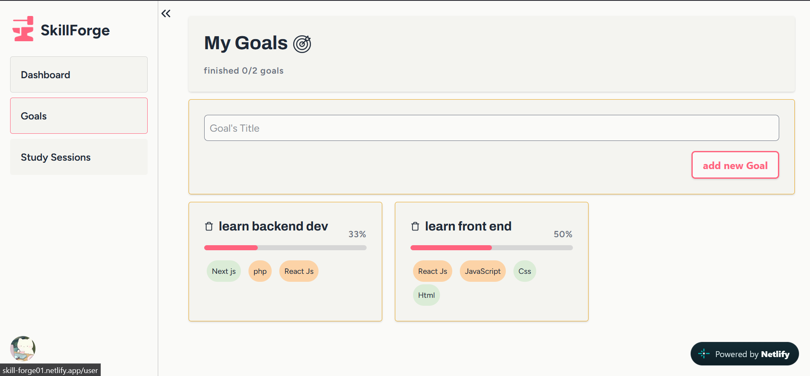
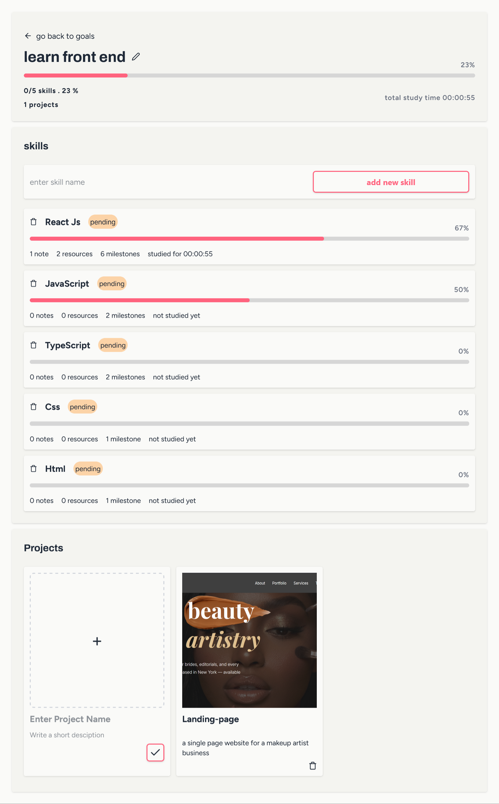
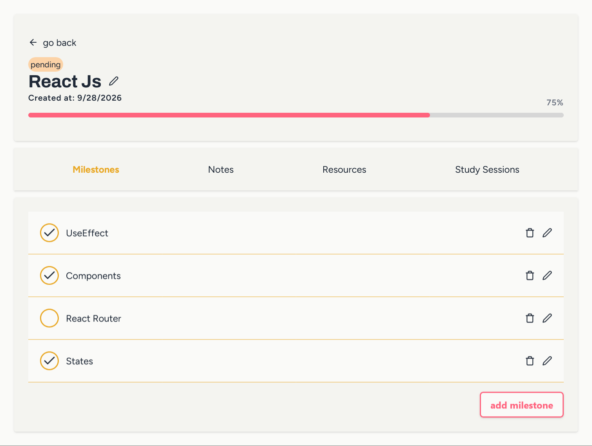
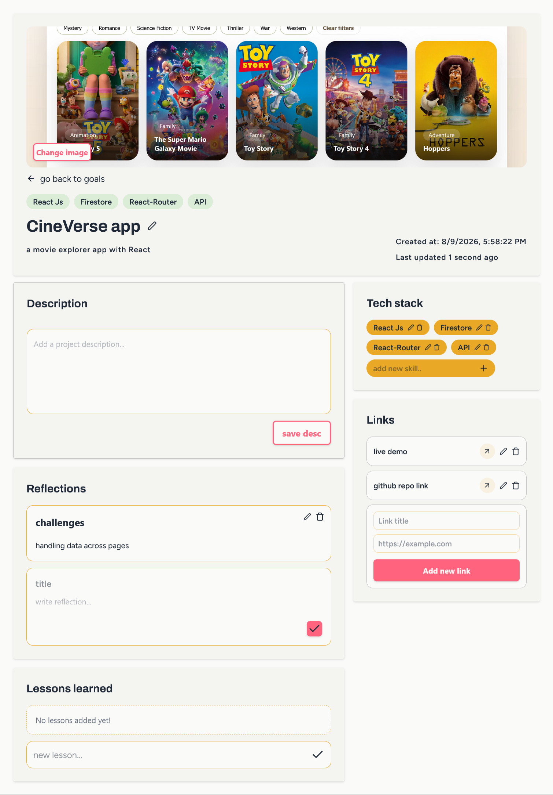
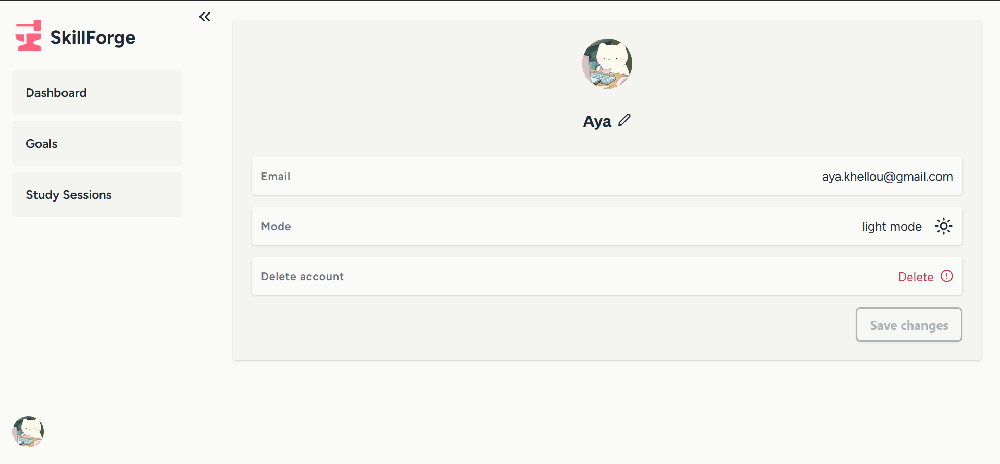

# SkillForge 🛠️:

>A personal learning management platform designed to help self-learners turn their goals into structured, trackable learning journeys.

**SkillForge** is a full-stack learning management web application built to make self-directed learning more organized and intentional.

Instead of keeping learning goals, skills, resources, notes, and study sessions scattered across different tools, SkillForge brings them together into one personal workspace.

🔗 **[Live Demo](https://skill-forge01.netlify.app/)**  
💻 **[GitHub Repository](https://github.com/AyaKhellou/skill-forge)**

<br>

## ScreenShots 📸:













<br>

## Features✨

### Goal Management 🎯

Create and manage learning goals and organize the work required to achieve them.

- Create learning goals
- Track goal progress
- View individual goal details
- Organize skills and projects under goals
- Update and delete goals

### Skill Management 🧠

Break larger goals into individual skills that can be developed over time.

- Create and manage skills
- Track skill progress
- Add milestones
- Attach notes and learning resources
- Track study sessions

### Learning Resources 📚

Keep useful learning material connected to the skill you're currently studying.

Resources can include links and other references that help keep the learning process organized.

### Notes 📝

Create notes directly inside your learning workflow instead of keeping them separated from the skill or goal they belong to.

### Study Sessions ⏱️

Record study sessions and use them as part of your learning progress.

SkillForge also uses recent study activity to provide a better overview of what you're currently working on.

### Dashboard 📊

The dashboard provides an overview of your learning activity, including:

- Current goals
- Skills
- Recent activity
- Learning progress
- Study information

### User Profiles 👤 

Each user has their own profile and personalized learning workspace.

Users can:

- Manage their profile information
- Upload a profile picture
- Toggle between light and dark mode
- Manage their learning data

### Authentication 🔐 

SkillForge uses Firebase Authentication to provide secure user accounts.

Supported authentication methods include:

- Email & password
- Google authentication

User-specific application data is stored separately in Firestore.

### Dark Mode 🌙 

The application supports both light and dark themes, with the user's preference persisted to their profile.

<br>

## Tech Stack

### Frontend

- React
- React Router
- JavaScript
- Vite
- Tailwind CSS
- Lucide React icons and SweetAlert2 dialogs

### Backend / Services

- Firebase Authentication
- Cloud Firestore
- Cloudinary — image uploads

### Development Tools

- VS Code
- Git
- GitHub
- Netlify

<br>

## App Architecture

SkillForge follows a component-based React architecture with reusable hooks and service functions.

```text
src/
├── components/       Shared interface components
├── hooks/            Data hooks for profiles, goals, skills, and projects
├── layouts/          Public and authenticated app layouts
├── pages/            Landing, account, dashboard, and tracking pages
├── services/         Firestore operations and utility functions
├── App.jsx           Route definitions
├── AuthContext.jsx   Firebase authentication state
└── firebase-config.js Firebase client initialization
```

## Data Organization

The app stores user data in Firestore using this hierarchy:

```text
users/{userId}
└── goals/{goalId}
	 ├── projects/{projectId}
	 └── skills/{skillId}
		  ├── milestones/{milestoneId}
		  ├── notes/{noteId}
		  ├── resources/{resourceId}
		  └── studySessions/{sessionId}
```
## App Areas

| URL | Purpose |
| --- | --- |
| `/` | Public landing page |
| `/login` | Sign in with email/password or Google |
| `/signup` | Create an account with email/password or Google |
| `/user` | Dashboard (requires authentication) |
| `/user/goals` | Browse and create goals |
| `/user/goals/:goalId` | Manage a goal's skills and projects |
| `/user/goals/:goalId/skills/:skillId` | Skill milestones, notes, resources, and study sessions |
| `/user/goals/:goalId/projects/:projectId` | Project details and supporting material |
| `/user/study-sessions` | Start a timed study session and review recent sessions |
| `/user/settings` | Profile settings |

## Requirements

- Node.js and npm (use a current LTS release)
- A Firebase project with Authentication and Cloud Firestore configured
- A Cloudinary account if you want profile-photo and project-image uploads

## Run Locally

1. Clone the repository and enter the project directory:

	```sh
	git clone https://github.com/AyaKhellou/skill-forge
	cd SkillForge
	```

2. Install dependencies:

	```sh
	npm install
	```

3. Configure Firebase and, if needed, Cloudinary as described below.

4. Start the Vite development server:

	```sh
	npm run dev
	```

	Open the local URL printed by Vite in your browser.

## Service Configuration

### Firebase

Firebase settings are currently declared in [`src/firebase-config.js`](src/firebase-config.js), rather than loaded from environment variables. For your own deployment, create a Firebase web app and replace the `firebaseConfig` values in that file with your project's web app configuration.

In the Firebase console:

1. Enable **Email/Password** and **Google** under Authentication sign-in providers.
2. Create a Cloud Firestore database.
3. Add the domains you use for local development and deployment to Authentication's authorized domains.
4. Configure Firestore Security Rules before using real user data. The app stores each user's records beneath `users/{userId}`; rules should restrict reads and writes to the authenticated owner (`request.auth.uid == userId`). Do not use open rules in production.

### Cloudinary

Image uploads are implemented in `src/services/function.js`. The Cloudinary cloud name and unsigned upload preset are currently written directly in that function. Configure those values for your own Cloudinary account if you want users to upload profile and project images. Restrict the unsigned preset (for example, allowed formats and upload size) in Cloudinary

## Available Scripts

| Command | Description |
| --- | --- |
| `npm run dev` | Start the Vite development server. |
| `npm run build` | Create a production build in `dist/`. |
| `npm run preview` | Serve the production build locally for a final check. |
| `npm run lint` | Run ESLint across the project. |


```
## Production Build and Deployment

Run `npm run build` to generate the static site in `dist/`, then deploy that directory to your static hosting provider. Configure the host to serve `index.html` for application routes so URLs such as `/user/goals` load correctly. The repository includes `public/_redirects` with a Netlify-style single-page-app fallback; configure the equivalent rewrite rule if your host uses a different format.

Before deployment, use your own Firebase project and Cloudinary upload preset, set the correct Firebase authorized domains, and verify Firestore rules. Then run `npm run preview` to inspect the production build locally.
